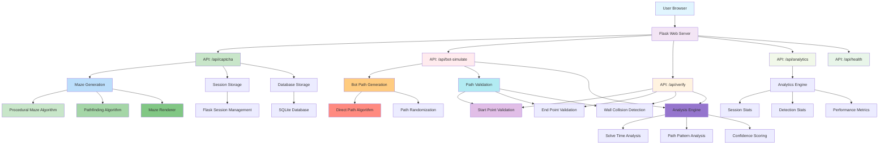
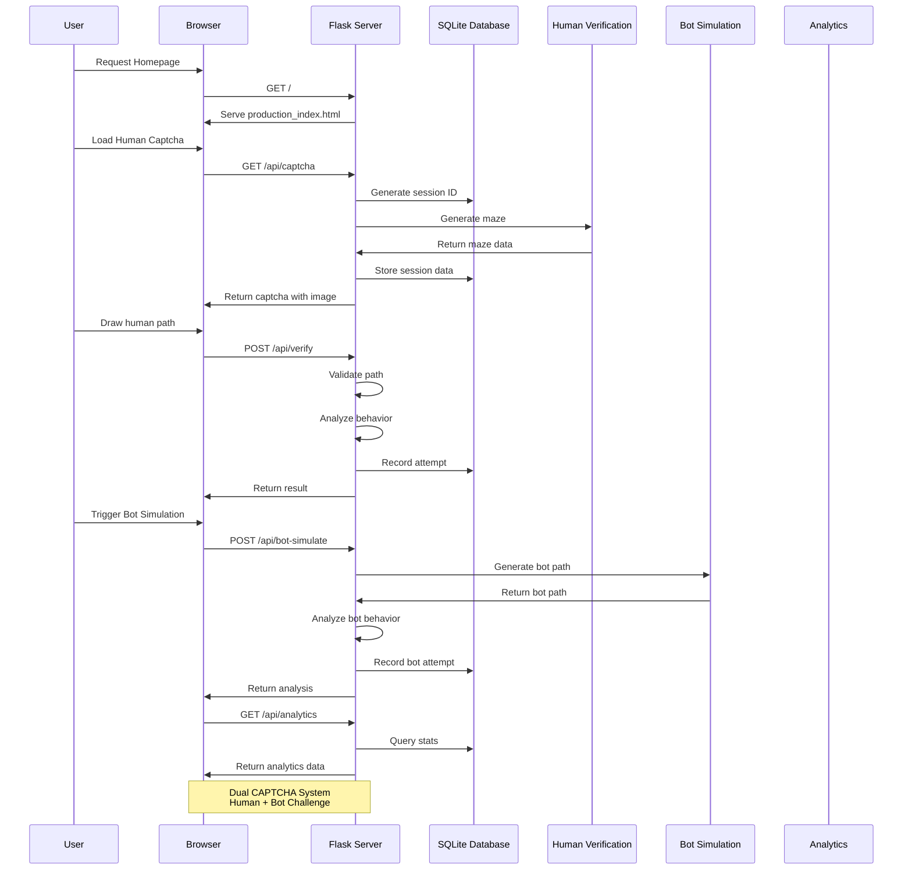
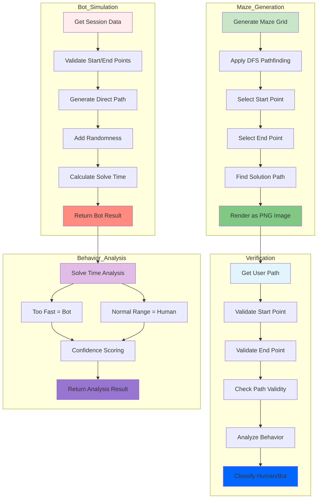
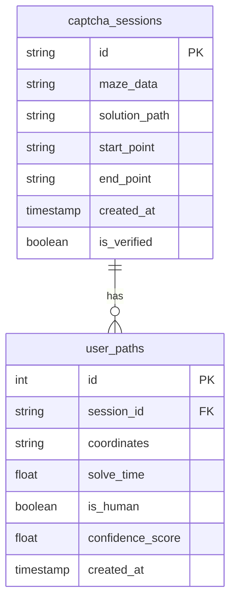
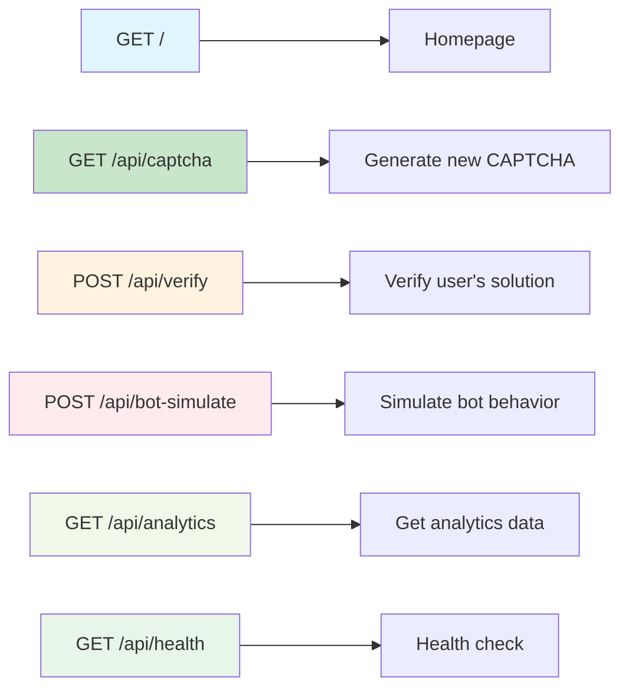

# Behavioral Maze CAPTCHA System - Architecture

## System Overview

The Behavioral Maze CAPTCHA is a Flask-based web application that uses procedural maze generation with behavioral analysis to distinguish between human users and bots.

## System Architecture

## Request Flow

## Component Details

## Database Schema

## API Endpoints

## Key Features

1. **Procedural Maze Generation** - Uses recursive backtracking (DFS) to generate random solvable mazes
2. **Behavioral Analysis** - Detects bots by analyzing solve time and path patterns
3. **Dual Challenge System** - Side-by-side human and bot captchas
4. **Real-time Analytics** - Tracks detection stats and performance metrics
5. **SQLite Persistence** - Stores sessions and attempts for analysis

## Tech Stack

- **Backend**: Flask (Python web framework)
- **Database**: SQLite3
- **Image Processing**: OpenCV, NumPy
- **Frontend**: Vanilla JavaScript, Canvas API, Chart.js
- **Styling**: Custom CSS with Inter font